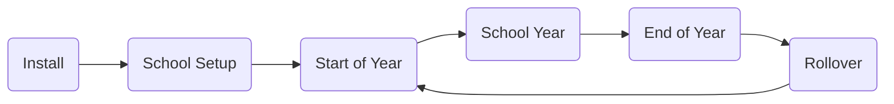
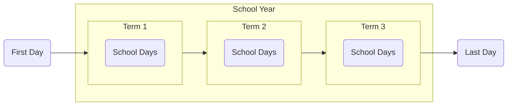

# The Gibbon Lifecycle

Once your installation is up and running, there are several actions that often happen with regular frequency. Especially since Gibbon is designed to help manage school data, the lifecycle of Gibbon will often follow a school's academic calendar.

## Server Administration

Along side the day-to-day tasks of the school year, the following are recommended administration actions and tools that can help keep Gibbon in good working order:
- Establish a clear [Backup Plan](/administration/backing-up-your-system) for both your file system and your database.
- Setup [Command Line Tools](/administration/command-line-tools) to update data and schedule notifications automatically.
- Plan for regular [Server Maintenance](/administration/server-maintenance) to keep your server software up-to-date.
- Aim to [Update Gibbon](/administration/updating-gibbon) when new releases are available, generally twice per year.

## One School Year to the Next

The largest unit of time in Gibbon is a **School Year**. Many different types of records are attached to a school year, and are archived when [rolling over to a new school year](/modules/admin/user-admin/rollover). 

::: tip
A rollover is an essential process that starts a new school year, enrols students, and updates users based on their status. The rollover performs a lot of work that would otherwise need to be done manually.
:::

School years have a first day and a last day, and are managed in <u>School Admin > Manage School Years</u>.

- **School years are divided into terms**
  These may be called semesters or terms depending on your region, and managed though <u>School Admin > Manage Terms</u>. If you don't use terms, you can set one term that covers the whole year.
  
- **Terms are divided into days**
  The days within each term can be managed through <u>School Admin > Manage Special Days</u>, as well as timetabled with <u>Timetable Admin > Tie Days to Dates</u>.
  
- **Days are viewed week by week**
  Many areas of Gibbon display a weekly view, such as the timetable, the staff coverage system, and various reports. You can set the timings of the week in  <u>School Admin > Days of the Week</u>.

Here is an example checklist of the various tasks a school admin team might perform throughout the school year and in preparation for a rollover and new school year:

::: tip Sample Spreadsheet
[Gibbon: Example Checklist for School Year Startup](https://docs.google.com/spreadsheets/d/1Zq3QOvYqFIjxw26R2B1G2CEJ0Vrj5gmbXEdioCJ-XZU/edit?usp=drivesdk)
:::

Users with permission can switch to different school years using the Year Switcher on the dashboard, or by choosing a school year during login. This enables them to access records that are attached to specific school years.

## One Version to the Next

We recommend keeping Gibbon up-to-date with the latest version. Generally, a new version of Gibbon is released twice per year, and exact release dates can be found in the [Gibbon Road Map](/development/gibbon-road-map).

Since new versions of the core often add new features, many schools will choose to update Gibbon between school years or between terms. In this case, we recommend <u>a minimum of one update per year</u>, to ensure you have the latest features and security updates.

::: warning NOTE
If a new version is marked as a Security Release, we highly recommend updating as soon as possible. These releases avoid adding new features, but often include fixes that aim to keep your system secure.
:::
