If your school uses GSuite (Formerly Google Apps), you can enable single sign on and calendar integration via Gibbon. This process makes use of Google APIs, including OAuth, and allows a user to access Gibbon without a username and password, provided that their listed email address is a Google account to which they have access

1\. Log in to the [Google developer console](https://cloud.google.com/console/project). This requires that you have an account with administrative privileges on your G Suite domain.

2\. Once logged in you need to create a new project by clicking the ___Create Project___ button:

[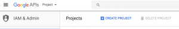](images/create-project.png)

3\. In the new project set-up dialog, give your project a name. Click the ___Create___ button:

[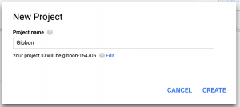](images/project-name.png)

4\. Projects in ___Organisations___:

If you do not see this image, then goto step 6.

[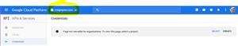](images/OrganisationError.JPG)

5\. Select the ___Project___ to use.

[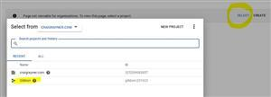](images/SelectProject.JPG)

6\.Click on the ___Credentials___ tab:

[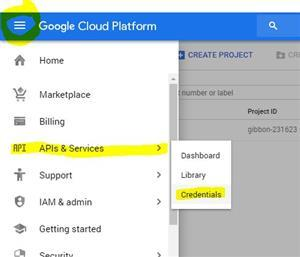](images/ClickCredentials.JPG)

7\. Then click **Create** **credentials**:

[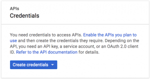](images/05-select-credential-300x158.png)

8\. Click Choose **OAuth2 Client ID**:

7\. If you have not already configured the consent screen, at this point you will be required to do so:

[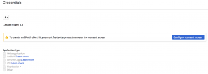](images/consent-screen.png)

8\. Fill in the details for the ___Application Name___, ___Support Email___ and ___Authorised Domains___ then click Save.

[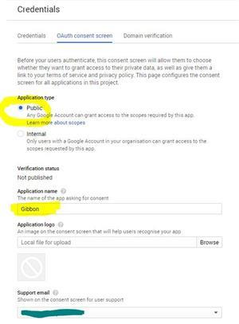](images/OAuthConsentScreen1.JPG)

[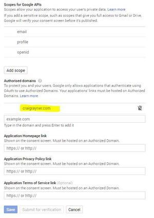](images/OAuthConsentScreen2.JPG)

9\. In the new client ID window, do the following:

*   Choose Web Application.
*   Set Authorised Javascript origins to the url of gibbon on your server.
*   Set Authorised Redirect URI to http://www.your-gibbon-install/lib/google/index.php. The googleOAuth folder is in the in the lib folder of Gibbon v14.0.00 and above on your server.
*   Click create client ID:

[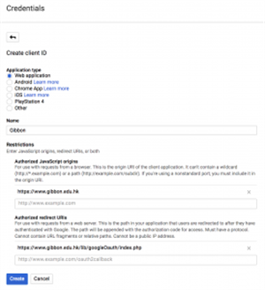](images/create-client-id.png)

10\. After this is complete, the client id details will be given to you: 

[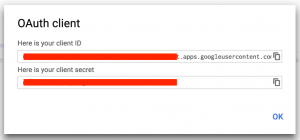](images/client-id-details.png)

(Save the client ID and client secret for step 16.)

11\. Create an API key: 

[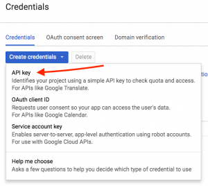](images/api-key.png)

12\. Save the API Key for step 16: 

[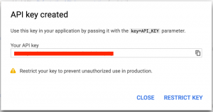](images/api-key-created.png)

13\. Leave the Key Restriction blank: 

[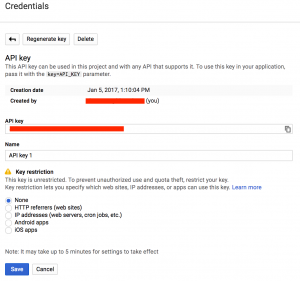](images/key-restriction.png)

14\. Add the Calendar API by ___Selecting the Library___

[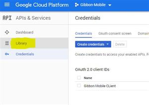](images/SelectLibrary.JPG)

15\. Select the ___Calendar API___ in the ___G Suite___ Section

[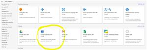](images/EnableCalendarAPI.JPG)

16\. Everything is now set up on the Google side, so you can enter your details into Gibbon by going to ___Home___ > ___System Admin___ > **Third Party Settings**. The details you need to enter into are as follows.

*   Google Developers Client Name
*   Google Developers Redirect URI (See step 9 above)

[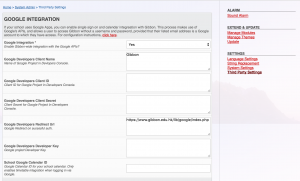](images/AuthenticationGibbon.png) 

Use details from steps 10 & 12 or click on the Credentials tab: For the following use: Google Developers Client ID = Yellow Google Developers Client Secret = Red Google Developers Client Name = Blue Google Developers Redirect Url = Green 

[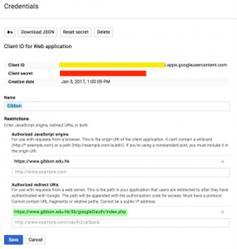](images/ClientId.png) 

API Key (Called ___Developer Key___ on Gibbon in older versions.): 

[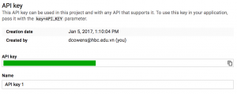](images/APIKeyDetails.png)

17\. On the Gibbon home page when you Logout, you should now see a ___Sign In With Google___ button, which allows users to enter the system without their Gibbon username and password.

18\. When a user logs in using Google, their personal calendar, if not yet set, will be set to their primary Google Calendar.

19\. In additional, the school can specify a Google Calendar for all users to have in their timetable. To set this up, go to ___Home___ > **System Admin** > ___Third Party Settings___ and set the ___School Google Calendar ID___
___School Google Calendar ID___ field to the ID of a shared Google Calendar.
