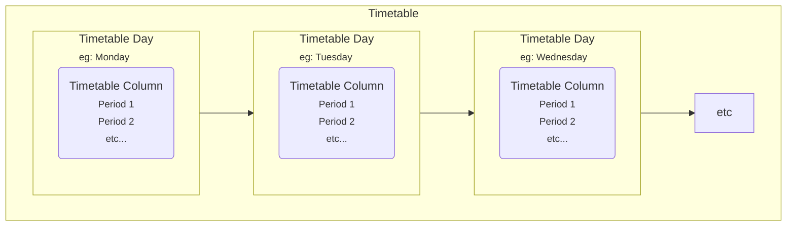

# Timetabling

Gibbon supports storing and rendering of timetables using a non-grid-restrained approach. The timetable is created in a systematic, interactive procedure that is easy to achieve and understand. Before you proceed:

1.  You should have created the school year(s) and the term(s).
2.  You should have a list of all the days the school is active
3.  You should have a list of all the activities the school does in all days the school is on.
4.  This should be in terms of the periods, the times and the activities of a particular time set.

## Timetable Structure

Timetabling uses a number of components to determine the overall structure of a school's timetable. Many of these components are re-usable, so it's helpful to understand how they all connect together:

- **Timetable Column**: These determine a reusable structure for a hypothetical day in any of your timetables. 
- **Timetable Row**: Columns are made up of rows, which determine which periods happen on a given day. Eg: Period 1, Period 2, Lunch Time, Period 3, etc.

::: tip Reusable Component
Timetable columns do not exist on their own, they define a structure that can be re-used when creating timetable days. If a school has the same timings for periods on every day of the week, they would only need one timetable column to create this structure.
:::

- **Timetable**: This holds the complete structure for which classes will run when, and is attached to a specific school year. You can have more than one timetable for different areas of the school (eg: primary and secondary), but a year group can only belong to one timetable.
- **Timetable Day**: Timetables are made up of timetable days. These determine how the structure of a day (timetable column) might apply to different days in the timetable (often weekdays, but could be a Day A, Day B, Day C etc. structure).
- **Classes by Period**: Editing a timetable day lets you start assigning which classes will run in the day, and the available periods are based on the column you chose.

- **Exceptions**: You can add exceptions if certain staff or students will not be present in a specific period of a specific class.
- **Tie Days to Dates**: This is often the final step in timetable creation, where you assign a timetable day (eg: Red Monday or Day A) to an exact calendar date (eg: Sept 18). 

::: warning Troubleshooting Note
If your timetable is blank after setting up all the timetable days, be sure you've tied the days to dates. Your timetable day may be called "Monday", but it isn't attached to the calendar until it's assigned to a specific set of Monday's. This enables alternating timetable structures.
:::
## Creating A Timetable

1.  Go to Admin > Timetable Admin
2.  Use **Manage Courses & Classes** to create courses, and within these establish necessary classes.
3.  Use **Course Enrollment** to assign teachers and students to classes.
4.  Use **Manage Columns** to create time structures for distinct day patterns you have in your timetable cycle (e.g. if Monday, Wednesday and Friday follow one set of times, and Tuesday and Thursday follow one set of times, you will need two columns). For each column, add rows for all time periods (e.g. add Lesson rows for each instructional period, some Break rows in between, etc)
5.  Use **Manage Timetables** to create as many timetables as you need in a given school year. Most schools will require one timetable, but some schools (e.g. through schools) may require more. Each year group in each school year can only be connected to one timetable, but a timetable can be shared by multiple year groups (e.g. you can have a timetable for Years 7-11 and a separate one for Years 12-13). In each timetable you can specify a day entry for each type of day in your cycle. Each of these days is tied to a column (see step 4.), whose rows give it its timing structure. Once the column is assigned to a day, you can associate classes with the periods in that day.
6.  The final step is to assign timetable days to calendar days, which is done using **Tie Days To Dates**. If no records show under **Tie Days to Dates** make sure you have set up school terms under School Admin > **Manage Terms** .

## Example Columns, Rows, Timetables, and Days

Let's say your school runs Monday to Friday using one set of time periods on Monday-Wednesday-Friday and another set of time periods on Tuesday-Thursday. Furthermore, the school uses different times for Year 7-11 (5 periods per day) than for Year 12-13 (a longer day with 6 periods). To set this up, you could do the following:

1.  Manage Columns - Add four columns: Upper MWF, Upper TuTh, Lower MWF, and Lower TuTh -- one for each combination of year group and daily time pattern.
2.  Add Rows - Add to each of the four columns the rows needed to define the 5 Lesson periods and 4 Break periods for the lower year columns, and the 6 Lesson periods and 5 Break periods for the upper year columns.
3.  Manage Timetables - Add two timetables: Upper, and Lower -- for each one, select the appropriate Year Groups (Upper = 12, 13; Lower = 7, 8, 9, 10, 11)
4.  Add Days - Add five Days to each of the two timetables: three Days named Monday, Wednesday, and Friday that refer to the column Upper MWF, two days name Tuesday and Thursday that refer to column Upper TuTh, three Days that refer to the column Lower MWF, and two days that refer to the column Lower TuTh.

## Notes

*   Timetabling is always tricky. Gibbon's approach is a little tedious at times, but gives great flexibility. If you have any questions, check out our [support forum](https://ask.gibbonedu.org).
