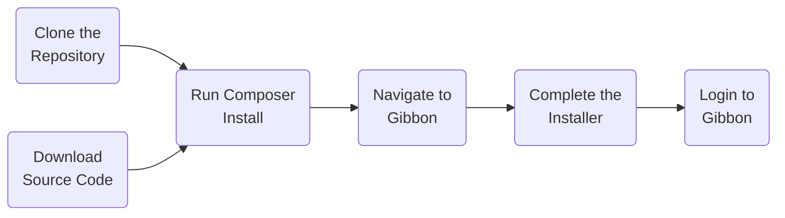

# Cutting Edge Code

Gibbon is released in two different ways, according to our release cycle and [Gibbon Road Map](/development/gibbon-road-map)

*   ___Stable Code___ - these are official releases, published through our [mailing list](https://gibbonedu.org/support/). They may be major releases (e.g. v10.0.0) or minor releases (e.g. v10.0.01), depending on a variety of circumstances. Stable releases are available via our [Download](https://gibbonedu.org/download/) page. Stable code enforces a much slower update cycle.
*   ___Cutting Edge Code___ - these are our latest code cuts, and so are not as well tested or refined as stable releases. They are not recommended for production, but do give access to the latest features, via an update cycle that is as fast as you like (or as we commit). Cutting edge code can be downloaded via the dev branches on [our GitHub repo](https://github.com/GibbonEdu/core).
## Developer Installation

During installation, your Gibbon code will check its version against our servers, and determine whether it is stable or cutting edge code. You cannot change this choice through the interface (and it is not recommended to change it via Inspect Element or some other means).

::: warning Note
As of Gibbon v22.0.00, Cutting Edge code uses composer to manage the vendor folder. See the installation and update instructions below.
:::

If you are using Cutting Edge code, before installing Gibbon you will need to first install PHP's dependency manager, [Composer](https://getcomposer.org/), on your server. Follow the [Getting Started](https://getcomposer.org/doc/00-intro) guides on the Composer website for more instructions about how to do this. 

Using composer, navigate to your root Gibbon folder and run the `composer install` command once to install all required libraries. You can also run `composer install --no-dev` to exclude any libraries that are used solely for development and testing.

## Updating

The [update proceedure](/administration/updating-gibbon) for stable and cutting edge code is nearly the same: the only variable is where you download the software from.

After updating a Cutting Edge code installation, you may see a message that composer needs to be updated. To do this, navigate to your root Gibbon folder and run the `composer install` command once to install or update the libraries in your vendor folder.
