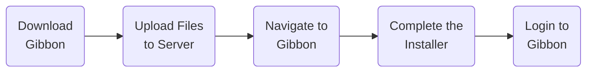

# Installing Gibbon

The basic installation process for Gibbon is:

### Quick Start

1. [Download](https://gibbonedu.org/download/) and unzip the latest version of the Gibbon Core.
2. Copy all files to your server, choosing either the root directory or a sub-folder within it.
3. Navigate your browser to the folder on your server where Gibbon has been located.
4. Follow the on-screen instructions in Gibbon's new installer.
5. Login to Gibbon, then check out the [Getting Started](/getting-started/next-steps) section for next steps.

For detailed instructions about each of these steps, continue reading the sections below.

## Video Guide

The video below gives an overview of the installation process:

<ClientOnly>
<iframe src="https://www.youtube.com/embed/jTj4KLEB-w8?start=133&end=1179" allowfullscreen="allowfullscreen" width="660" height="400" frameborder="0"></iframe>
</ClientOnly>

## Download Gibbon

Visit [Gibbon Download page](https://gibbonedu.org/download/) to download the Gibbon Core. This page always links to the latest version, which is the most stable release of Gibbon. 

All versions of Gibbon can be found on the [GitHub releases](https://github.com/GibbonEdu/core/releases) page. If you download from this page, be sure to download the Install Bundle, which includes all necessary files.

::: info Advanced Installation
Developers may wish to install [Cutting Edge Code](/introduction/installation-options/cutting-edge-code). This allows you to run the latest code from [our GitHub repo](https://github.com/GibbonEdu/core), however this is not recommended for production environments.
:::

## Upload Files

As self-hosted software, once you download Gibbon, you'll need to unzip it and upload the contents of this folder to your server. The location you upload to needs to be web-accessible via a URL or IP address. In most Linux web servers, this location is the `/var/www/html` directory, which is the default root folder of the web server. 

After uploading the files, depending on your server setup, you may also need to adjust the file permissions to ensure the web server can run them. On Linux servers, this can be done with the `chmod` and `chown` commands.

## Navigate to Gibbon

In a web browser, navigate to URL that corresponds to the directory where Gibbon is located. If you copied Gibbon into a sub-folder on your server, then the URL will likely contain your domain + the name of this subfolder.

::: tip Example
If you uploaded to `/var/www/html` then your URL will likely be https://yourdomain.com. If you used a sub-folder such as `/var/www/html/gibbon` then your URL will likely be https://yourdomain.com/gibbon.
:::
## Installation & Login

The installer will step you though the rest of the installation process, beginning with a system requirements check, and then creating and populating the Gibbon database. 

After completing the installer, you can navigate back to your Gibbon URL to login using the administrator user you created during installation.

### Demo Data

Integrated into the Gibbon installer, you can opt to include demo data when you configure your database to see what Gibbon looks like in a fully operational school. If you are setting up your system for use in production, do not install the demo data, to ensure you begin with a nice clean installation.

### Installer Troubleshooting

- If you see an error that Gibbon is `missing the composer autoloader`, then your vendor folder is either missing or not installed correctly. Be sure you are using a full Install Bundle from the Gibbon download page, or follow the composer instructions for [cutting edge code](/introduction/installation-options/cutting-edge-code). 
- If your installer does not load or you see a PHP error message, double-check that your server meets the system requirements and your web server has correct file permissions.

### Post-Install & Server Config {#post-install-server-config}

::: info Check your server after installation
After installing, be sure to follow the [Post-Installation](/introduction/post-installation) steps to ensure your system is running smoothly.
:::